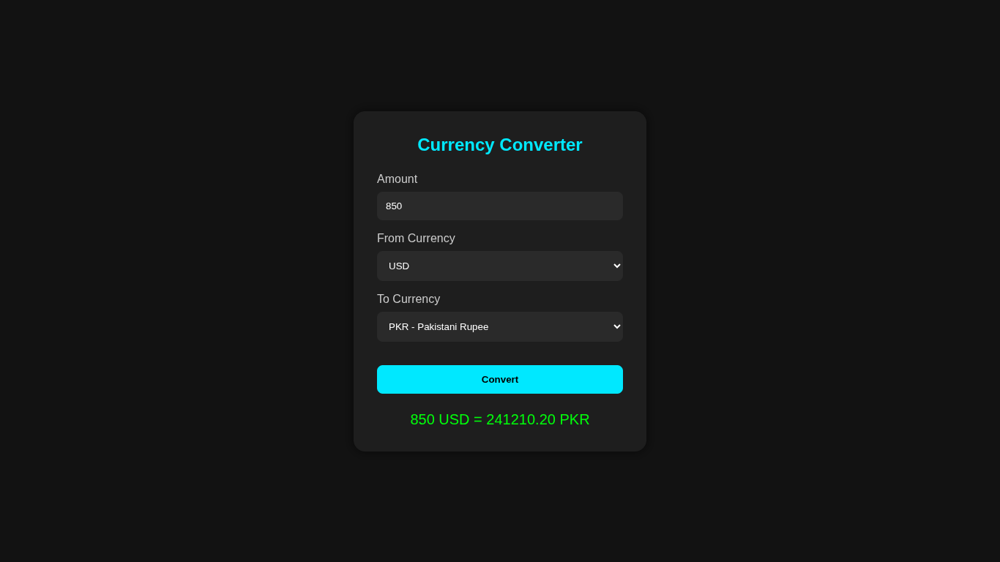

# 💱 Currency Converter App

A simple **Currency Converter** built with **Vanilla JavaScript**, allowing users to convert an amount from one currency to another in real-time using an external API.

---

## 🚀 Features

- Convert amounts between **any two currencies**
- Fetches **real-time exchange rates** from an external API
- Dynamic selection for **From** and **To** currencies
- Error handling for invalid API responses or unsupported currencies
- Updates results instantly on conversion

---

## 🛠 Technologies Used

- **HTML5**
- **CSS3**
- **Vanilla JavaScript (ES6)**
- **ExchangeRate-API** for currency data

---

## 📂 Project Structure

CurrencyExchangeApp/<br>
├── index.html # Main HTML file<br>
├── script.js # JavaScript logic<br>
└── README.md # This documentation<br>

---

## 🌐 How It Works

1. **Populate Currencies**
   - On load, the app fetches currency rates from the API.
   - Populates the "From" currency dropdown dynamically.

2. **Convert Amount**
   - Enter the amount to convert.
   - Select "From" and "To" currencies.
   - Click **Convert** to get the converted amount using the formula:
     ```
     convertedAmount = (inputValue / rate[from]) * rate[to]
     ```

3. **Error Handling**
   - If the API fails or an invalid currency is selected, an error message is displayed.

---

## ⚡ How to Run Locally

1. Open the `index.html` file in your browser
2. Ensure you have an active internet connection to fetch currency data

---

## 📸 Preview


---

## 📌 Notes

- The app uses the [ExchangeRate-API](https://www.exchangerate-api.com/) free tier for currency data.
- For large-scale use or production, an API key might be required.

---

## 📧 Contact

Created by **Zakryia Bukhari**  
Reach out for suggestions, feedback, or collaborations!
