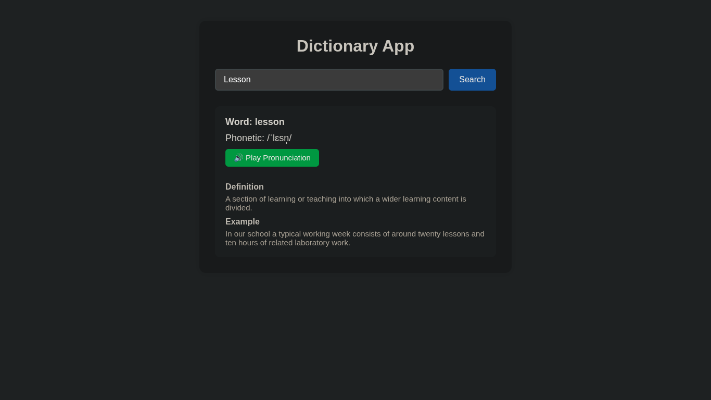

# 📖 Dictionary App

A simple **Dictionary App** built with **Vanilla JavaScript** that allows users to search for word meanings, phonetics, examples, and hear the pronunciation.

---

## 🚀 Features

- Search for any English word
- Displays **word**, **phonetic transcription**, **definition**, and **example sentence**
- **Text-to-Speech** pronunciation of the searched word
- Handles errors gracefully for invalid words or network issues

---

## 🛠 Technologies Used

- **HTML5**
- **CSS3**
- **Vanilla JavaScript (ES6)**
- **Free Dictionary API** ([https://dictionaryapi.dev/](https://dictionaryapi.dev/))
- **Web Speech API** for voice pronunciation

---

## 📂 Project Structure

DictionaryApp/ 
├── index.html # Main HTML file 
├── script.js # JavaScript logic 
├── style.css # Styling for App 
└── README.md # This documentation 

---

## 🌐 How It Works

1. **Search Word**
   - Enter a word in the input field
   - Click the **Search** button
   - Fetches word data from the Dictionary API

2. **Display Word Data**
   - Shows the **word**, **phonetic transcription**, **definition**, and **example**
   - If some information is missing, a fallback value (`N/A` or `No example available`) is displayed

3. **Text-to-Speech**
   - Click the **Play Voice** button to hear the word pronunciation
   - Uses the browser's `SpeechSynthesis` API

4. **Error Handling**
   - Invalid words or network errors trigger an error message
   - UI displays `---` for unavailable data

---

## ⚡ How to Run Locally

1. Open the `index.html` file in your browser  
2. Make sure you are connected to the internet to fetch data from the API

---
## 📸 Preview

---

## 📌 Notes

- Works entirely on the client-side, no backend required
- API is free and doesn’t require authentication

---

## 📧 Contact

Created by **Zakryia Bukhari**  
Feel free to suggest improvements or report issues!
