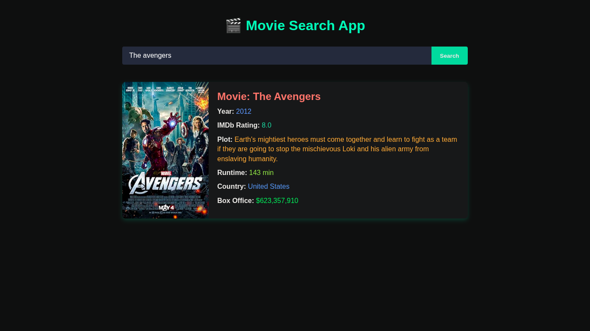

# 🎬 Movie Search App

A simple **Movie Search App** built with **Vanilla JavaScript** that allows users to search for movies and fetch detailed information using the **OMDb API**.

---

## 🚀 Features

- Search for any movie by its title
- Displays movie details including:
  - Poster
  - Title
  - Year of release
  - IMDb rating
  - Runtime
  - Country
  - Box Office collection
  - Plot/Storyline
- Handles invalid movie titles or network errors gracefully
- Uses a placeholder image if no poster is available

---

## 🛠 Technologies Used

- **HTML5**
- **CSS3**
- **Vanilla JavaScript (ES6)**
- **OMDb API** ([http://www.omdbapi.com/](http://www.omdbapi.com/))

---

## 📂 Project Structure

MovieSearchApp/ 
├── index.html # Main HTML file 
├── script.js # JavaScript logic 
├── styles.css # Styling for App 
└── README.md # This documentation 

---

## 🌐 How It Works

1. **Search Movie**
   - Enter the movie title in the search input
   - Click the **Search** button
   - Fetches movie data from the OMDb API using the API key

2. **Display Movie Data**
   - Shows movie **poster**, **title**, **year**, **IMDb rating**, **runtime**, **country**, **box office**, and **plot**
   - If the poster is unavailable, a placeholder image is displayed

3. **Error Handling**
   - Invalid movie names or network errors show an error message
   - The movie card is hidden when there’s an error

---

## ⚡ How to Run Locally

1. Open the `index.html` file in your browser  
2. Make sure you are connected to the internet to fetch data from the OMDb API  
3. Enter a movie title and click **Search** to see the details

---
## 📸 Preview

---

## 📌 Notes

- The app uses the free OMDb API key: `60b412e9`
- All operations run on the client-side
- Provides a simple and interactive way to search for movies

---

## 📧 Contact

Created by **Zakryia Bukhari**  
Feel free to suggest improvements or report issues!
