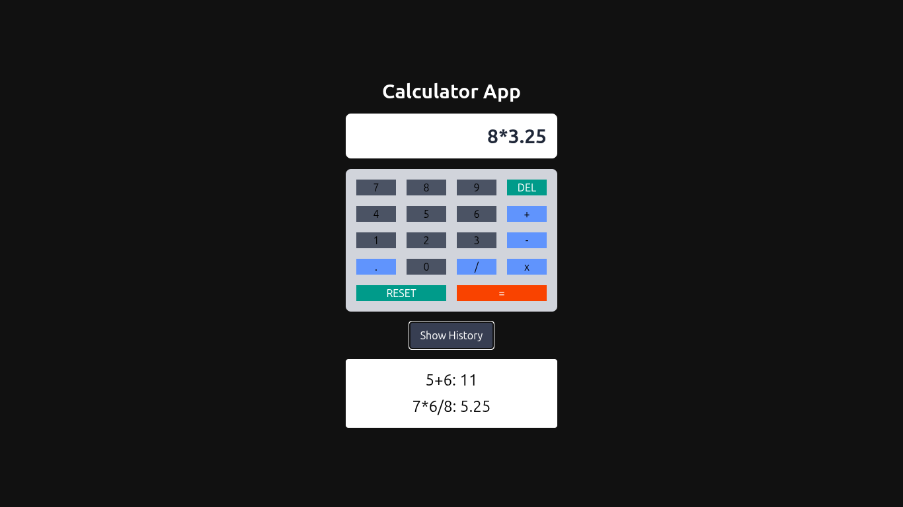

# 🔢 Calculator App (Vanilla JS + TailwindCSS CDN)

A fully functional **Calculator App** built using **Vanilla JavaScript** and styled using **TailwindCSS CDN**. It supports basic arithmetic operations, result history, and handles edge cases like divide-by-zero, double operators, and invalid inputs.

---

## 🚀 Features

- ✅ Perform basic calculations: `+`, `-`, `*`, `/`
- 📜 View calculation history (stored in `localStorage`)
- 🧠 Handles edge cases
- 🔁 Delete last character
- 🧹 Reset all input
- 💾 History persistence using `localStorage`
- 🎨 Stylish and responsive UI using TailwindCSS CDN

---

## 📸 Preview



---

## 🛠️ Tech Stack

- **HTML5**
- **Vanilla JavaScript**
- **TailwindCSS CDN**
- **localStorage API**

---

## 📂 Project Structure

calculator-app/<br>
├── index.html<br>
├── script.js<br>

---

## 📦 Setup Instructions

1. **Clone the Repository** or **Download ZIP**:

```bash
git clone https://github.com/your-username/calculator-app.git
```
2. **Open index.html in your browser**:
```bash
cd calculator-app
open index.html
```
No build tools or dependencies required – just HTML, JS, and TailwindCSS via CDN.

---

## 📋 Functionality Overview
- **➕ Input Buttons**:
Each number and operator button appends a character to the display.

- **🧮 Evaluation (=)**:
Uses eval() for quick arithmetic expression evaluation.

- **Result is displayed and saved to the history list**.

- **Example history**: 12+5: 17

- **🧹 Reset Button**: 
Clears the display and resets error state.

- **Delete Button**: 
Removes the last character from the input.

- **📜 Show History Button**: 
Toggles the display of previous calculations stored in localStorage.

---

## 🧠 Edge Case Handling

| 🚩 Edge Case                | ⚙️ Behavior           |
|---------------------------|----------------------|
| Starts with `*` or `/`    | Shows error          |
| Double decimal (`3.1.4`)  | Prevented manually   |
| Divide by zero (`10/0`)   | Returns `Infinity`   |
| Double operator (`12++5`) | Can show error       |
| Empty input on equal      | Ignored              |


---

## 🧑‍💻 Author
**Zikrya Bukhari**<br>
**GitHub**: https://github.com/Zakariya-Zahid

---

## 📄 License
This project is open source and available under the MIT License.

---