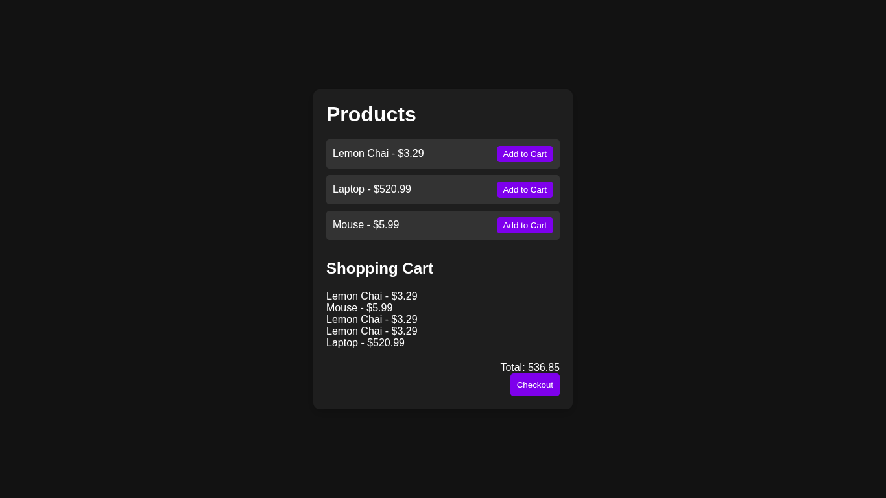

# 🛒 Basic E-commerce Cart

A simple **JavaScript-based e-commerce cart** that lets users browse products, add them to the cart, view the total price, and checkout.  
Perfect for learning DOM manipulation and basic cart functionality.

---

## 🚀 Features

- Display a list of products with prices
- Add products to the cart
- Dynamic cart rendering with product names and prices
- Total price calculation
- Empty cart message when no items are added
- Checkout function that clears the cart

---

## 🛠 Technologies Used

- **HTML5**
- **CSS3**
- **Vanilla JavaScript (ES6)**

---

## 📂 Project Structure

EcommerceCart/<br>
 ├── index.html<br>
 ├── script.js/<br>
 ├── readme.md/<br>
 ├── styles.css/<br>

---
## 📸 Preview


---

## ⚡ How to Run Locally

1. **Clone this repo** or **Download ZIP**:

```bash
git clone https://github.com/Zakariya-Zahid/web-dev-projects.git
```
2. Open index.html in your browser:
```bash
cd NotesApp
open index.html
```
---


## 🙌 Author
**Zikrya Bukhari**<br>
**GitHub**: https://github.com/Zakariya-Zahid

---

## 📜 License

This project is licensed under the MIT License — you are free to use, modify, and distribute it.