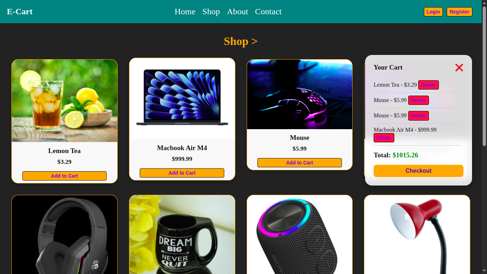

# 🛒 Extended E-commerce Cart

A fully-featured **E-commerce Cart** built with **Vanilla JavaScript**.  
Users can browse products with images, add them to the cart, delete items, view total price, and checkout.  
Cart data is **persisted in localStorage**, so it stays after page reloads.

---

## 🚀 Features

- **Product catalog** with images, names, and prices
- **Add to cart** functionality
- **Cart modal** with dynamic rendering of items
- **Delete individual items** from the cart
- **Total price calculation** in real-time
- **Checkout functionality** with alert confirmation
- **Cart persistence** using `localStorage`
- **Responsive and visually appealing product cards**
- **Show/Hide cart modal** for better UX

---

## 🛠 Technologies Used

- **HTML5**
- **CSS3**
- **Vanilla JavaScript (ES6)**
- **localStorage API** for cart persistence

---

## 📂 Project Structure

Ecommerce_Cart_Extended/<br>
 ├── index.html<br>
 ├── images/<br>
 ├── script.js/<br>
 ├── readme.md/<br>
 ├── style.css/<br>

---
## 📸 Preview


---

## ⚡ How to Run Locally

1. **Clone this repo** or **Download ZIP**:

```bash
git clone https://github.com/Zakariya-Zahid/web-dev-projects.git
```
2. Open index.html in your browser:
```bash
cd ecommerce_cart_extended
open index.html
```
---


## 🙌 Author
**Zikrya Bukhari**<br>
**GitHub**: https://github.com/Zakariya-Zahid

---

## 📜 License

This project is licensed under the MIT License — you are free to use, modify, and distribute it.