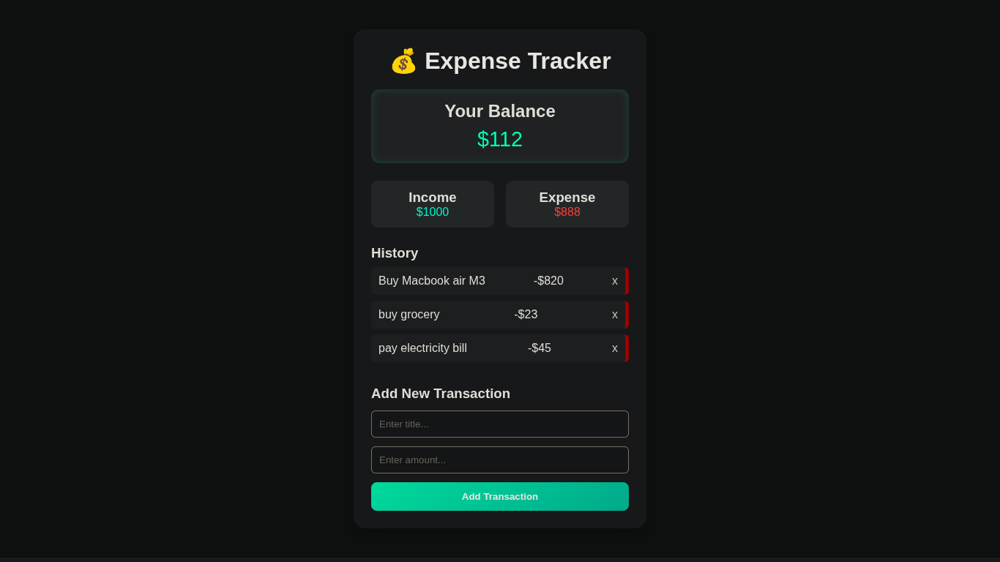

# 💰 Expense Tracker

A simple **Expense Tracker** built with **Vanilla JavaScript**.  
Keep track of your expenses, view your balance in real-time, and manage your transactions efficiently.  
All transactions are **saved in localStorage** for persistence across page reloads.

---

## 🚀 Features

- **Add new expenses** with a title and amount
- **Delete transactions** individually
- **Real-time balance updates**
- **Displays total income, total expenses, and available balance**
- **Persistent storage** using `localStorage`
- Alerts if trying to spend more than the available balance

---

## 🛠 Technologies Used

- **HTML5**
- **CSS3**
- **Vanilla JavaScript (ES6)**
- **localStorage API** for persistence

---

## 📂 Project Structure

ExpenseTracker/<br>
 ├── index.html<br>
 ├── script.js/<br>
 ├── readme.md/<br>
 ├── styles.css/<br>

---
## 📸 Preview


---

## ⚡ How to Run Locally

1. **Clone this repo** or **Download ZIP**:

```bash
git clone https://github.com/Zakariya-Zahid/web-dev-projects.git
```
2. Open index.html in your browser:
```bash
cd ExpenseTracker
open index.html
```
---


## 🙌 Author
**Zikrya Bukhari**<br>
**GitHub**: https://github.com/Zakariya-Zahid

---

## 📜 License

This project is licensed under the MIT License — you are free to use, modify, and distribute it.