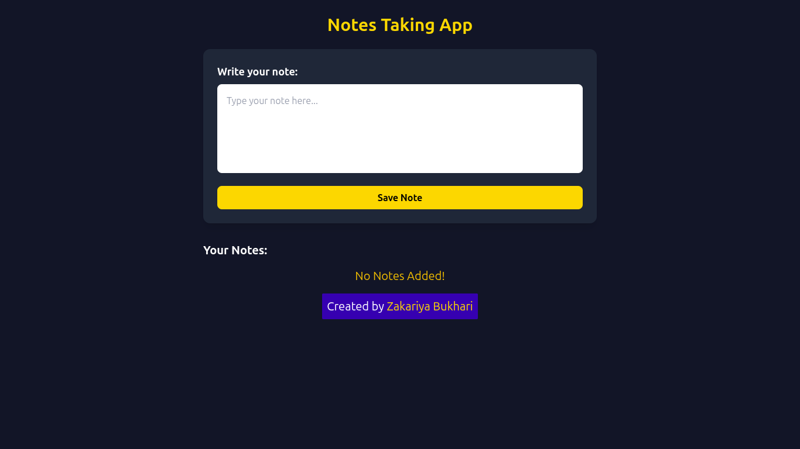

# 📝 Notes App

A minimal **Notes Management** application built with **Vanilla JavaScript**.  
It lets you create, edit, and delete notes with automatic **localStorage persistence**, so your notes remain saved even after refreshing the page.

---

## 🚀 Features

- **Create Notes** with timestamp
- **Edit Notes** in place
- **Delete Notes** instantly
- **Persistent Storage** using `localStorage`
- Displays a **"No Notes Added"** message when empty
- **Responsive & clean UI** styled with TailwindCSS

---

## 🛠 Technologies Used

- **HTML5**
- **CSS3 / TailwindCSS**
- **Vanilla JavaScript (ES6)**
- **localStorage API**

---

## 📂 Project Structure

NotesApp/<br>
 ├── index.html<br>
 ├── script.js/<br>
 ├── readme.md/<br>

---
## 📸 Preview


---

## ⚡ How to Run Locally

1. **Clone this repo** or **Download ZIP**:

```bash
git clone https://github.com/Zakariya-Zahid/web-dev-projects.git
```
2. Open index.html in your browser:
```bash
cd NotesApp
open index.html
```
---


## 🙌 Author
**Zikrya Bukhari**<br>
**GitHub**: https://github.com/Zakariya-Zahid

---

## 📜 License

This project is licensed under the MIT License — you are free to use, modify, and distribute it.