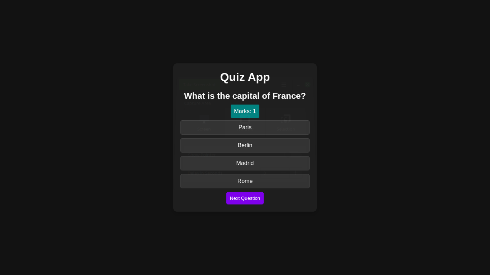

# 📝 Quiz App

A **JavaScript-based Quiz Application** that allows users to answer multiple-choice questions, track scores, and see results.  
Perfect for testing knowledge and practicing DOM manipulation.

---

## 🚀 Features

- Display **multiple-choice questions** one at a time
- Track **selected answers** and **calculate score** based on marks per question
- Highlight the **selected option**
- Show **total score** at the end
- **Restart quiz** functionality
- Works entirely on the **client-side** with Vanilla JavaScript

---

## 🛠 Technologies Used

- **HTML5**
- **CSS3**
- **Vanilla JavaScript (ES6)**

---

## 📂 Project Structure


QuizApp/<br>
 ├── index.html<br>
 ├── script.js<br>
 ├── readme.md<br>
 ├── styles.css<br>

---
## 📸 Preview


---

## ⚡ How to Run Locally

1. **Clone this repo** or **Download ZIP**:

```bash
git clone https://github.com/Zakariya-Zahid/web-dev-projects.git
```
2. Open index.html in your browser:
```bash
cd QuizApp
open index.html
```
---


## 🙌 Author
**Zikrya Bukhari**<br>
**GitHub**: https://github.com/Zakariya-Zahid

---

## 📜 License

This project is licensed under the MIT License — you are free to use, modify, and distribute it.