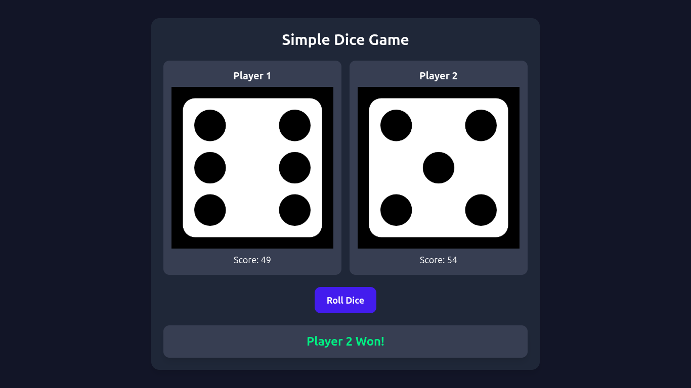

# 🎲 Simple Dice Game

A fun and interactive **two-player dice game** built with **Vanilla JavaScript**.  
Players roll dice, scores get updated automatically, and the first player to cross **50 points** wins!

---

## 🚀 Features

- **Two-player gameplay** with alternating dice rolls
- **Random dice rolls** using `Math.random()`
- **Dynamic score updates**
- **Win detection** (Player 1, Player 2, or Draw)
- **Reset game** after a match ends
- **Visual dice images** for each roll

---

## 🛠 Technologies Used

- **HTML5**
- **CSS3**
- **Vanilla JavaScript (ES6)**

---

## 📂 Project Structure

SimpleDiceGame/<br>
 ├── index.html<br>
 ├── script.js/<br>
 ├── readme.md<br>

---


---

## 🎮 How to Play

1. **Click** the "Roll Dice" button to roll for both players.
2. The score increases based on the dice result.
3. **First player** to reach more than **50 points** wins.
4. If both players cross **50 points** in the same round → **DRAW!**
5. After a match ends, clicking the button again **resets the game**.

---

## 📸 Preview


---

## ⚡ How to Run Locally

1. Clone this repository:
   ```bash
   git clone https://github.com/Zakariya-Zahid/web-dev-projects.git
    ```
2. Open index.html in your browser:
    ```bash
    cd NotesApp
    open index.html
    ```

---


## 🙌 Author
**Zikrya Bukhari**<br>
**GitHub**: https://github.com/Zakariya-Zahid

---

## 📜 License

This project is licensed under the MIT License — you are free to use, modify, and distribute it.
