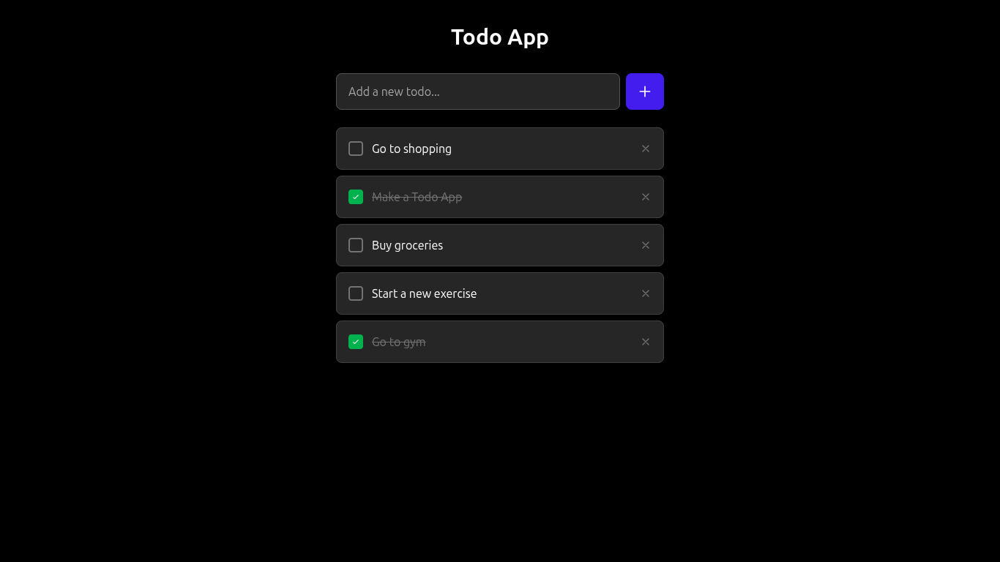

# 📝 To-Do List App (Vanilla JS + TailwindCSS CDN)

A simple and elegant **To-Do List** web application built using **Vanilla JavaScript** and styled using **TailwindCSS CDN**. It allows users to add, mark as complete, and delete tasks. Data persists using **localStorage**.

## 🚀 Features

- ✅ Add new tasks
- 🟢 Mark tasks as completed
- ✅ Delete tasks
- 💾 Persistent storage with `localStorage`
- 🎨 Clean and responsive UI using TailwindCSS CDN

---

## 📸 Preview



---

## 📁 Project Structure

todo-app/<br>
├── index.html<br>
└── script.js


---

## 📦 Tech Stack

- **JavaScript (ES6+)**
- **TailwindCSS** (via CDN)
- **HTML5**
- **localStorage API**

---

## 🛠️ Setup Instructions

1. **Clone this repo** or **Download ZIP**:

```bash
git clone https://github.com/your-username/todo-app.git
```
2. Open index.html in your browser:
```bash
cd todo-app
open index.html
```
---
## 🧠 How It Works
When the page loads, existing tasks are fetched from localStorage.
Adding a task creates a new object with id, text, and completed status.
Tasks are dynamically rendered with:

- ✔️ Complete button (toggles task status)

- 🗑️ Delete button (removes task)

- All actions update localStorage to keep data persistent.

---

## 🙌 Author
**Zikrya Bukhari**<br>
**GitHub**: https://github.com/Zakariya-Zahid

---

## 📄 License
This project is open source and available under the MIT License.

---