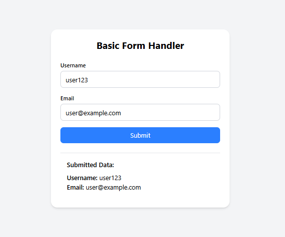

# 📝 Form Handler (React)

A comprehensive **Form Handler** built with **React** demonstrating form validation, controlled components, and modern form handling patterns with real-time feedback.

---

## Preview


---
## 🚀 Features

- 📝 Multiple input types (text, email, password, textarea)
- ✅ Real-time form validation
- 🎯 Controlled components
- 📊 Form submission handling
- 🔍 Input validation feedback
- 📱 Responsive form design
- 🎨 Clean and accessible UI
- ⚡ Instant validation messages

---

## 🛠️ Tech Stack

- **React 18+**
- **useState Hook**
- **Form Validation**
- **CSS3**
- **Vite**
- **JavaScript (ES6+)**

---

## 📂 Project Structure

form-handler/
├── src/
│   ├── App.jsx # Main form component
│   ├── main.jsx # Entry point
│   └── index.css # Form styles
├── package.json
└── README.md

---

## ⚡ Setup Instructions

1. **Install Dependencies**:
```bash
npm install
```

2. **Start Development Server**:
```bash
npm run dev
```

3. **Open in Browser**:
   - Navigate to `http://localhost:5173`

---

## 🌐 How It Works

1. **Controlled Components**:
   - All form inputs are controlled by React state
   - Real-time state updates as user types
   - Single source of truth for form data

2. **Form Validation**:
   - Email format validation
   - Password strength requirements
   - Required field validation
   - Real-time error messages

3. **Form Submission**:
   - Prevents default form submission
   - Validates all fields before submission
   - Displays success/error messages
   - Resets form after successful submission

---

## 🔧 Key React Concepts Used

- **useState Hook** - Form state management
- **Controlled Components** - Input value binding
- **Event Handling** - Form interactions
- **Conditional Rendering** - Validation messages
- **Form Validation** - Input validation logic
- **Prevent Default** - Form submission handling

---

## 📌 Form Fields

- **Name**: Required text input
- **Email**: Email format validation
- **Password**: Minimum length requirement
- **Message**: Optional textarea
- **Submit Button**: Form submission trigger

---

## 🎯 Validation Rules

```jsx
// Example validation logic
const validateEmail = (email) => {
  const emailRegex = /^[^\s@]+@[^\s@]+\.[^\s@]+$/
  return emailRegex.test(email)
}

const validatePassword = (password) => {
  return password.length >= 6
}
```

---

## 🙌 Author

**Zakryia Bukhari**  
GitHub: https://github.com/Zakariya-Zahid

---

## 📄 License

This project is open source and available under the MIT License.