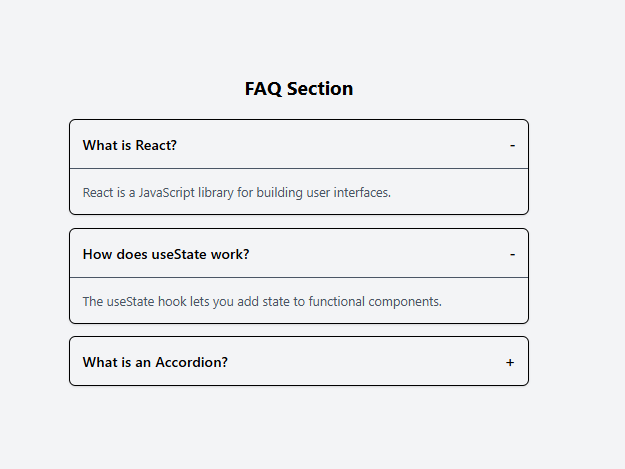

# ❓ Toggle FAQ (React)

A simple **FAQ Component** built with **React** demonstrating toggle functionality, conditional rendering, and state management for expandable content sections.

---

## Preview

---
## 🚀 Features

- ❓ Expandable FAQ sections
- 🔄 Toggle show/hide functionality
- 📱 Responsive design
- 🎨 Clean and accessible UI
- ⚡ Smooth transitions
- 📝 Multiple FAQ items

---

## 🛠️ Tech Stack

- **React 18+**
- **useState Hook**
- **CSS3**
- **Vite**
- **JavaScript (ES6+)**

---

## ⚡ Setup Instructions

1. **Install Dependencies**:
```bash
npm install
```

2. **Start Development Server**:
```bash
npm run dev
```

3. **Open in Browser**:
   - Navigate to `http://localhost:5173`

---

## 🔧 Key React Concepts Used

- **useState Hook** - Toggle state management
- **Conditional Rendering** - Show/hide content
- **Event Handling** - Click interactions
- **Component State** - Individual FAQ state

---

## 🙌 Author

**Zakryia Bukhari**