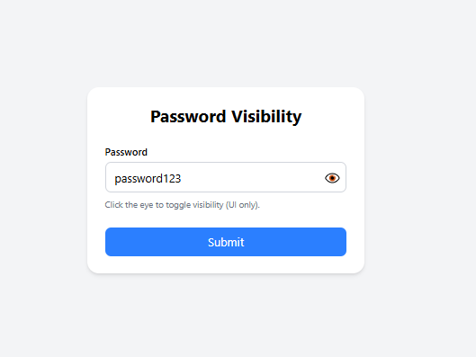

# 👁️ Toggle Password (React)

A **Password Visibility Toggle** component built with **React** that allows users to show/hide password input with a toggle button for better user experience.

---

## Preview



---
## 🚀 Features

- 👁️ Show/hide password functionality
- 🔒 Secure password input
- 🎯 Toggle button with visual feedback
- 📱 Responsive design
- 🎨 Clean and intuitive UI

---

## 🛠️ Tech Stack

- **React 18+**
- **useState Hook**
- **CSS3**
- **Vite**
- **JavaScript (ES6+)**

---

## ⚡ Setup Instructions

1. **Install Dependencies**:
```bash
npm install
```

2. **Start Development Server**:
```bash
npm run dev
```

3. **Open in Browser**:
   - Navigate to `http://localhost:5173`

---

## 🔧 Key React Concepts Used

- **useState Hook** - Password visibility state
- **Conditional Rendering** - Input type switching
- **Event Handling** - Toggle functionality

---

## 🙌 Author

**Zakryia Bukhari**