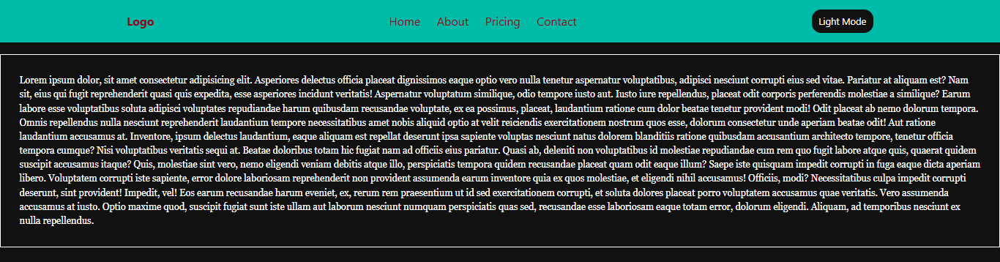

# 🌓 Toggle Theme Basic (React)

A basic **Theme Toggle** component built with **React** demonstrating simple dark/light mode switching using component state and CSS classes.

---

## Preview



---
## 🚀 Features

- 🌙 Dark/Light theme toggle
- 🎨 CSS-based theme switching
- 🔄 Simple toggle button
- 📱 Responsive design

---

## 🛠️ Tech Stack

- **React 18+**
- **useState Hook**
- **CSS3**
- **Vite**
- **JavaScript (ES6+)**

---

## ⚡ Setup Instructions

1. **Install Dependencies**:
```bash
npm install
```

2. **Start Development Server**:
```bash
npm run dev
```

3. **Open in Browser**:
   - Navigate to `http://localhost:5173`

---

## 🔧 Key React Concepts Used

- **useState Hook** - Theme state management
- **Conditional Rendering** - Theme-based styling
- **Event Handling** - Theme toggle

---

## 🙌 Author

**Zakryia Bukhari**