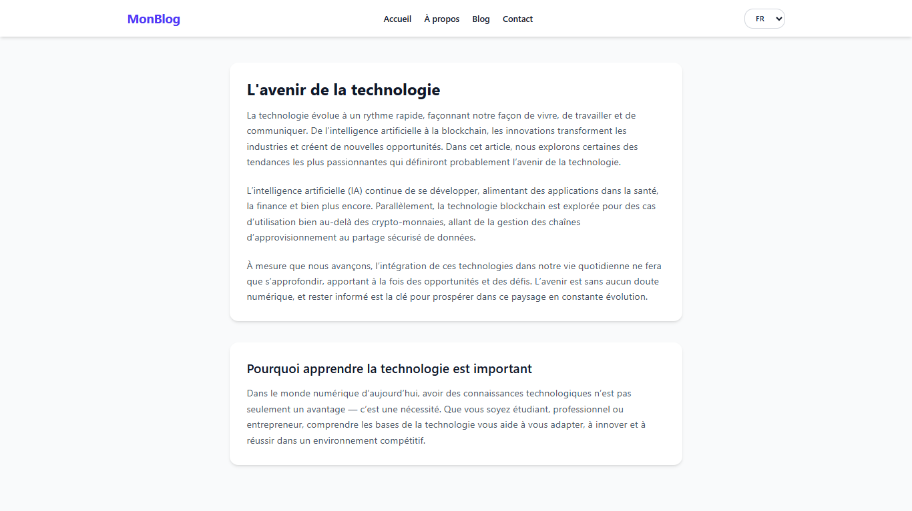

# 🌍 Language Switcher (React)

A **Multi-language Support** application built with **React** and **Context API** demonstrating internationalization (i18n) implementation with dynamic language switching.

---

## Preview



---
## 🚀 Features

- 🌍 Multi-language support
- 🔄 Dynamic language switching
- ⚛️ Context API for global state
- 📝 Localized content rendering
- 🎨 Clean language selector UI
- 📱 Responsive design

---

## 🛠️ Tech Stack

- **React 18+**
- **Context API**
- **Internationalization (i18n)**
- **CSS3**
- **Vite**
- **JavaScript (ES6+)**

---

## 📂 Project Structure

language-switcher/
├── src/
│   ├── component/
│   │   └── Blog.jsx # Demo content component
│   ├── context/
│   │   ├── LanguageContext.js # Language context
│   │   └── LanguageContextProvider.jsx # Context provider
│   ├── App.jsx # Main component
│   └── main.jsx # Entry point

---

## ⚡ Setup Instructions

1. **Install Dependencies**:
```bash
npm install
```

2. **Start Development Server**:
```bash
npm run dev
```

3. **Open in Browser**:
   - Navigate to `http://localhost:5173`

---

## 🔧 Key React Concepts Used

- **Context API** - Global language state
- **useContext Hook** - Language context consumption
- **Component Composition** - Modular architecture
- **Internationalization** - Multi-language support

---

## 🙌 Author

**Zakryia Bukhari**