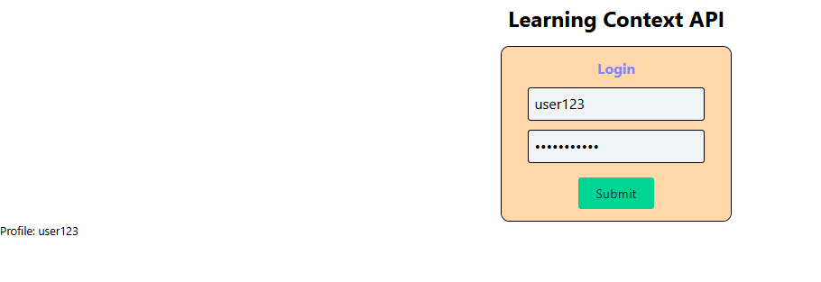

# 👤 Mini Context Demo (React)

A simple **User Authentication Context** demonstration built with **React** and **Context API** showing login/logout functionality and user state management across components.

---

## Preview



---
## 🚀 Features

- 👤 User authentication simulation
- 🔐 Login/Logout functionality
- ⚛️ Context API for user state
- 🎯 Component-based architecture
- 📱 Responsive design

---

## 🛠️ Tech Stack

- **React 18+**
- **Context API**
- **useState Hook**
- **CSS3**
- **Vite**
- **JavaScript (ES6+)**

---

## 📂 Project Structure

mini-context-demo/
├── src/
│   ├── components/
│   │   ├── Login.jsx # Login component
│   │   └── Profile.jsx # User profile component
│   ├── context/
│   │   ├── UserContext.js # User context
│   │   └── UserContextProvider.jsx # Context provider
│   └── App.jsx # Main component

---

## ⚡ Setup Instructions

1. **Install Dependencies**:
```bash
npm install
```

2. **Start Development Server**:
```bash
npm run dev
```

3. **Open in Browser**:
   - Navigate to `http://localhost:5173`

---

## 🔧 Key React Concepts Used

- **Context API** - Global user state
- **useContext Hook** - Context consumption
- **useState Hook** - Local state management
- **Component Composition** - Login/Profile components

---

## 🙌 Author

**Zakryia Bukhari**