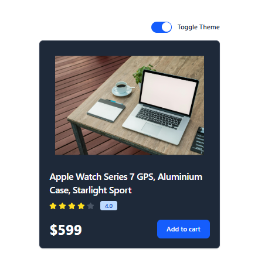

# 🎨 Theme Switcher (React + TailwindCSS)

A modern **Theme Switcher** component built with **React**, **Context API**, and **TailwindCSS** that provides seamless dark/light mode switching with persistent storage.

---

## Preview



---
## 🚀 Features

- 🌙 Dark/Light theme toggle
- 💾 Theme persistence with localStorage
- ⚛️ Context API for global state management
- 🎨 TailwindCSS for responsive styling
- 🔄 Smooth theme transitions
- 📱 Mobile-friendly design
- 🎯 Reusable theme context and components

---

## 🛠️ Tech Stack

- **React 18+**
- **Context API**
- **TailwindCSS**
- **Local Storage**
- **Vite**
- **JavaScript (ES6+)**

---

## 📂 Project Structure

theme-switcher/
├── src/
│   ├── components/
│   │   ├── contexts/
│   │   │   └── theme.js # Theme context
│   │   ├── Card.jsx # Demo card component
│   │   └── ThemeBtn.jsx # Theme toggle button
│   ├── App.jsx # Main component
│   ├── main.jsx # Entry point
│   └── index.css # Global styles
├── tailwind.config.js # TailwindCSS config
├── package.json
└── README.md

---

## ⚡ Setup Instructions

1. **Install Dependencies**:
```bash
npm install
```

2. **Start Development Server**:
```bash
npm run dev
```

3. **Open in Browser**:
   - Navigate to `http://localhost:5173`

---

## 🌐 How It Works

1. **Theme Context**:
   - Creates a global theme context using React Context API
   - Manages theme state and provides theme switching functionality
   - Persists theme preference in localStorage

2. **Theme Provider**:
   - Wraps the entire application
   - Provides theme state and toggle function to all components
   - Automatically applies theme class to document

3. **Theme Button**:
   - Reusable toggle button component
   - Uses theme context to switch between themes
   - Provides visual feedback for current theme

4. **Persistent Storage**:
   - Saves user's theme preference to localStorage
   - Restores theme on page reload
   - Defaults to system preference if no saved theme

---

## 🔧 Key React Concepts Used

- **Context API** - Global state management
- **useContext Hook** - Consuming context values
- **useState Hook** - Local component state
- **useEffect Hook** - Side effects and lifecycle
- **Custom Hooks** - Reusable logic extraction
- **Component Composition** - Modular architecture

---

## 🎨 TailwindCSS Features

- **Dark Mode Classes** - `dark:` prefix for dark theme styles
- **CSS Variables** - Custom color schemes
- **Responsive Design** - Mobile-first approach
- **Smooth Transitions** - Theme switching animations

---

## 📌 Usage Example

```jsx
// Using the theme context in components
import { useTheme } from './contexts/theme'

function MyComponent() {
  const { themeMode, toggleTheme } = useTheme()
  
  return (
    <div className="bg-white dark:bg-gray-800">
      <button onClick={toggleTheme}>
        Current theme: {themeMode}
      </button>
    </div>
  )
}
```

---

## 🙌 Author

**Zakryia Bukhari**  
GitHub: https://github.com/Zakariya-Zahid

---

## 📄 License

This project is open source and available under the MIT License.