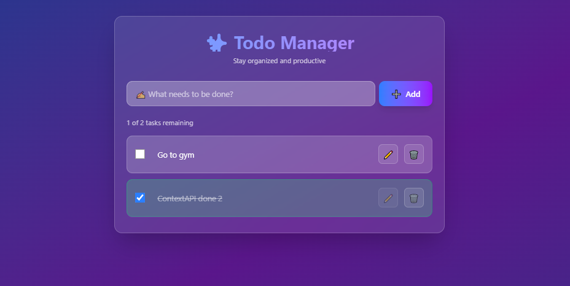

# ✅ Todo Context Demo (React)

A feature-rich **Todo Application** built with **React** and **Context API** demonstrating advanced state management, CRUD operations, and component composition patterns.

---

## 📸 Preview



---

## 🚀 Features

- ✅ Add new todos
- ✏️ Edit existing todos inline
- 🗑️ Delete todos
- ☑️ Mark todos as complete/incomplete
- 💾 Persistent storage with localStorage
- ⚛️ Context API for state management
- 🎨 Clean and intuitive UI
- 📱 Responsive design


## 🛠️ Tech Stack

- **React 18+**
- **Context API**
- **Local Storage**
- **TailwindCSS**
- **Vite**
- **JavaScript (ES6+)**

---

## 📂 Project Structure

todo-context-demo/
├── src/
│   ├── components/
│   │   ├── TodoForm.jsx # Add todo form
│   │   ├── TodoItem.jsx # Individual todo item
│   │   └── index.js # Component exports
│   ├── context/
│   │   ├── TodoContext.js # Todo context definition
│   │   └── index.js # Context exports
│   ├── App.jsx # Main component
│   ├── main.jsx # Entry point
│   └── index.css # Global styles
├── package.json
└── README.md

---

## ⚡ Setup Instructions

1. **Install Dependencies**:
```bash
npm install
```

2. **Start Development Server**:
```bash
npm run dev
```

3. **Open in Browser**:
   - Navigate to `http://localhost:5173`

---

## 🌐 How It Works

1. **Todo Management**:
   - Add new todos using the input form
   - Edit todos by clicking on them (inline editing)
   - Mark todos as complete/incomplete with checkbox
   - Delete todos with the delete button

2. **Context API Implementation**:
   - TodoContext provides global state management
   - All components access todo state through context
   - Centralized todo operations (add, update, delete, toggle)

3. **Persistent Storage**:
   - Todos are saved to localStorage automatically
   - Data persists between browser sessions
   - Automatic loading of saved todos on app start

4. **Component Architecture**:
   - TodoForm: Handles new todo creation
   - TodoItem: Manages individual todo display and actions
   - App: Main container with context provider

---

## 🔧 Key React Concepts Used

- **Context API** - Global state management
- **useContext Hook** - Consuming context values
- **useState Hook** - Local component state
- **useEffect Hook** - Side effects and persistence
- **Component Composition** - Modular architecture
- **Controlled Components** - Form input handling
- **Event Handling** - User interactions

---

## 🎯 Context Structure

```jsx
// TodoContext provides:
const todoContext = {
  todos: [], // Array of todo items
  addTodo: (todo) => {}, // Add new todo
  updateTodo: (id, todo) => {}, // Update existing todo
  deleteTodo: (id) => {}, // Delete todo
  toggleComplete: (id) => {} // Toggle completion status
}
```

---

## 📌 Features Breakdown

- **Add Todo**: Create new todos with unique IDs
- **Edit Todo**: Inline editing with save/cancel options
- **Toggle Complete**: Visual feedback for completed todos
- **Delete Todo**: Remove todos with confirmation
- **Persistence**: Automatic localStorage integration
- **Responsive**: Works on all screen sizes

---

## 🙌 Author

**Zakryia Bukhari**  
GitHub: https://github.com/Zakariya-Zahid

---

## 📄 License

This project is open source and available under the MIT License.