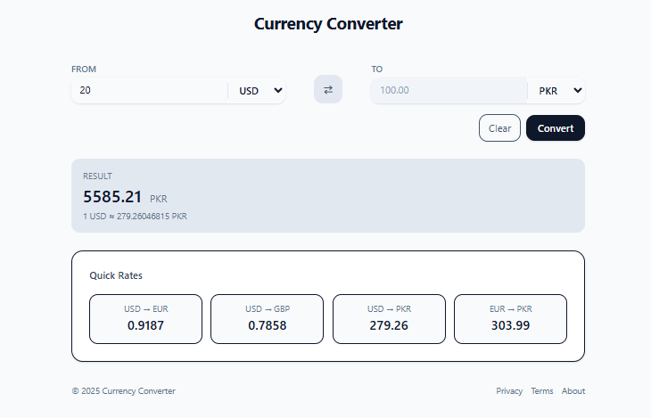

# 💱 Currency Converter (React)

A real-time **Currency Converter** app built with **React** and **custom hooks** that provides live exchange rates and seamless currency conversion between multiple currencies.

---

## Preview


---
## 🚀 Features

- 💰 Real-time currency conversion
- 🌍 Support for multiple currencies
- 🔄 Currency swap functionality
- 📊 Live exchange rates
- 🎯 Custom hooks for API integration
- 📱 Responsive design
- ⚡ Fast and efficient conversions
- 🎨 Clean and intuitive UI

---

## 🛠️ Tech Stack

- **React 18+**
- **Custom Hooks**
- **Currency API**
- **TailwindCSS**
- **Vite**
- **JavaScript (ES6+)**

---

## 📂 Project Structure

currency-converter/
├── src/
│   ├── components/
│   │   ├── ConveterCard.jsx # Main converter component
│   │   └── index.js # Component exports
│   ├── hooks/
│   │   └── useCurrency.js # Custom currency hook
│   ├── App.jsx # Main component
│   ├── main.jsx # Entry point
│   └── index.css # Global styles
├── package.json
└── README.md

---

## ⚡ Setup Instructions

1. **Install Dependencies**:
```bash
npm install
```

2. **Start Development Server**:
```bash
npm run dev
```

3. **Open in Browser**:
   - Navigate to `http://localhost:5173`

---

## 🌐 How It Works

1. **Currency Selection**:
   - Choose source and target currencies from dropdown menus
   - Support for major world currencies (USD, EUR, GBP, JPY, etc.)

2. **Real-time Conversion**:
   - Enter amount in source currency
   - Automatically calculates converted amount
   - Updates in real-time as you type

3. **Currency Swap**:
   - Quick swap button to reverse conversion direction
   - Maintains entered amount while swapping currencies

4. **Live Exchange Rates**:
   - Fetches current exchange rates from currency API
   - Updates rates periodically for accuracy
   - Handles API errors gracefully

---

## 🔧 Key React Concepts Used

- **Custom Hooks** - Reusable currency fetching logic
- **useState Hook** - Managing component state
- **useEffect Hook** - API calls and side effects
- **Component Composition** - Modular converter card
- **Event Handling** - User input and interactions
- **Conditional Rendering** - Loading states and error handling

---

## 🎯 Custom Hook Features

The `useCurrency` hook provides:
- Currency data fetching
- Error handling
- Loading states
- Automatic data caching
- Reusable across components

```jsx
// Usage example
const currencyInfo = useCurrency(currency)
```

---

## 📌 Notes

- Requires internet connection for live rates
- Exchange rates update automatically
- Supports decimal precision for accurate conversions
- Responsive design works on all devices

---

## 🙌 Author

**Zakryia Bukhari**  
GitHub: https://github.com/Zakariya-Zahid

---

## 📄 License

This project is open source and available under the MIT License.