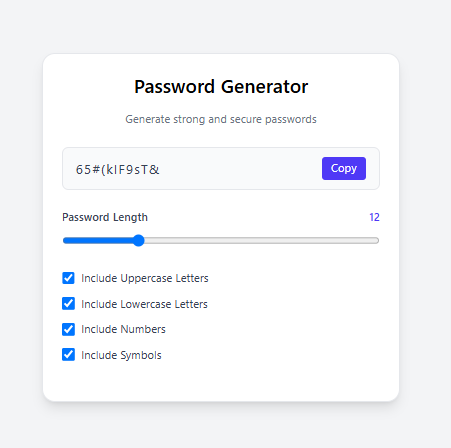

# 🔐 Password Generator (React)

A secure **Password Generator** built with **React** that creates customizable passwords with various options and includes copy-to-clipboard functionality for enhanced user experience.

---

## Preview

---
## 🚀 Features

- 🔢 Customizable password length (4-50 characters)
- 🔤 Include/exclude uppercase letters
- 🔡 Include/exclude lowercase letters  
- 🔢 Include/exclude numbers
- 🔣 Include/exclude special characters
- 📋 One-click copy to clipboard
- 🎯 Real-time password generation
- 📱 Responsive design
- 🎨 Clean and intuitive UI

---

## 🛠️ Tech Stack

- **React 18+**
- **useState Hook**
- **useEffect Hook**
- **useRef Hook**
- **useCallback Hook**
- **Clipboard API**
- **TailwindCSS**
- **Vite**
- **JavaScript (ES6+)**

---

## 📂 Project Structure

password-generator/
├── src/
│   ├── App.jsx # Main component
│   ├── main.jsx # Entry point
│   └── index.css # Global styles
├── package.json
└── README.md

---

## ⚡ Setup Instructions

1. **Install Dependencies**:
```bash
npm install
```

2. **Start Development Server**:
```bash
npm run dev
```

3. **Open in Browser**:
   - Navigate to `http://localhost:5173`

---

## 🌐 How It Works

1. **Password Customization**:
   - Adjust password length using range slider
   - Toggle checkboxes for character types
   - Real-time password generation as options change

2. **Character Sets**:
   - **Uppercase**: A-Z
   - **Lowercase**: a-z  
   - **Numbers**: 0-9
   - **Special Characters**: !@#$%^&*()_+-=[]{}|;:,.<>?

3. **Copy Functionality**:
   - Click copy button to copy password to clipboard
   - Visual feedback when password is copied
   - Uses modern Clipboard API for secure copying

4. **Validation**:
   - Ensures at least one character type is selected
   - Minimum password length validation
   - Error handling for clipboard operations

---

## 🔧 Key React Concepts Used

- **useState Hook** - Managing component state
- **useEffect Hook** - Side effects and password generation
- **useRef Hook** - DOM element references
- **useCallback Hook** - Optimized function memoization
- **Event Handling** - User input and interactions
- **Conditional Rendering** - Dynamic UI updates

---

## 🎯 Password Generation Logic

```jsx
// Character sets
const uppercase = 'ABCDEFGHIJKLMNOPQRSTUVWXYZ'
const lowercase = 'abcdefghijklmnopqrstuvwxyz'
const numbers = '0123456789'
const symbols = '!@#$%^&*()_+-=[]{}|;:,.<>?'

// Generate password based on selected options
const generatePassword = useCallback(() => {
  let charset = ''
  if (includeUppercase) charset += uppercase
  if (includeLowercase) charset += lowercase
  if (includeNumbers) charset += numbers
  if (includeSymbols) charset += symbols
  
  // Generate random password
}, [length, includeUppercase, includeLowercase, includeNumbers, includeSymbols])
```

---

## 📌 Security Features

- **Cryptographically Secure**: Uses Math.random() for password generation
- **No Storage**: Passwords are not stored anywhere
- **Client-Side Only**: All generation happens in the browser
- **Customizable Strength**: User controls complexity
- **Secure Copy**: Uses Clipboard API for safe copying

---

## 🎨 UI Features

- **Range Slider**: Visual password length selection
- **Toggle Switches**: Easy character type selection
- **Copy Button**: One-click clipboard functionality
- **Password Display**: Large, readable password output
- **Responsive Design**: Works on all screen sizes

---

## 🙌 Author

**Zakryia Bukhari**  
GitHub: https://github.com/Zakariya-Zahid

---

## 📄 License

This project is open source and available under the MIT License.