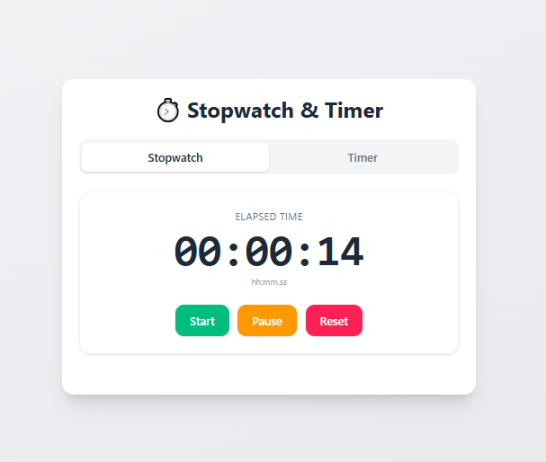
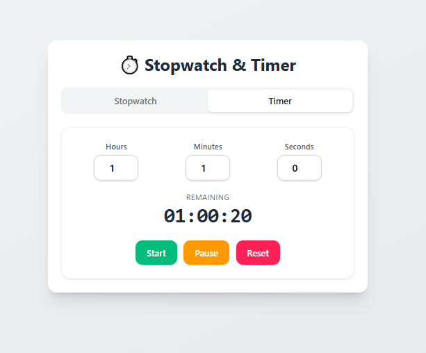

# ⏱️ Stopwatch (React)

A functional **Stopwatch Application** built with **React** featuring start, stop, reset functionality with precise time tracking and clean user interface.

---

## Preview


---
## 🚀 Features

- ⏱️ Precise time tracking
- ▶️ Start/Stop functionality
- 🔄 Reset timer
- 📊 Time display in MM:SS:MS format
- 🎨 Clean and intuitive UI
- 📱 Responsive design

---

## 🛠️ Tech Stack

- **React 18+**
- **useState Hook**
- **useEffect Hook**
- **JavaScript Intervals**
- **CSS3**
- **Vite**

---

## ⚡ Setup Instructions

1. **Install Dependencies**:
```bash
npm install
```

2. **Start Development Server**:
```bash
npm run dev
```

3. **Open in Browser**:
   - Navigate to `http://localhost:5173`

---

## 🔧 Key React Concepts Used

- **useState Hook** - Timer state management
- **useEffect Hook** - Interval management
- **Event Handling** - Button interactions
- **Cleanup Functions** - Interval cleanup

---

## 🙌 Author

**Zakryia Bukhari**