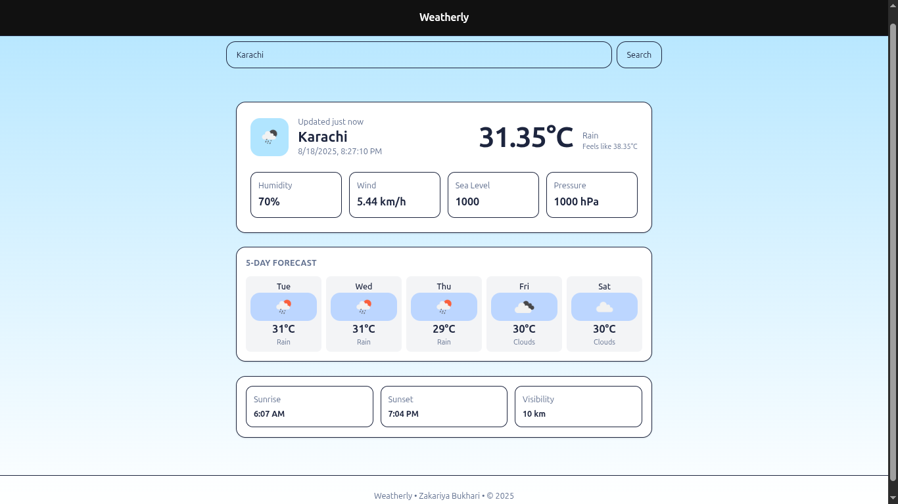

# 🌤️ Weather App (React)

A modern **Weather App** built with **React** and **TailwindCSS** that provides real-time weather information and 5-day forecasts for any city worldwide using the **OpenWeatherMap API**.

---

## 📸 Preview



---

## 🚀 Features

- 🔍 Search weather for any city worldwide
- 🌡️ Current weather information including:
  - Temperature (Celsius/Fahrenheit)
  - Weather description and icon
  - Humidity, wind speed, pressure
  - Sunrise/sunset times
  - Visibility and sea level
- 📅 5-day weather forecast
- 📱 Responsive design with modern UI
- ⏳ Loading states and error handling
- 🎨 Beautiful gradient background and card layouts

---


## 🛠️ Tech Stack

- **React 18+**
- **TailwindCSS** (Styling)
- **OpenWeatherMap API**
- **Vite** (Build tool)
- **JavaScript (ES6+)**

---

## 📂 Project Structure

weather-app/<br>
├── src/<br>
│   ├── App.jsx # Main component<br>
│   ├── main.jsx # Entry point<br>
│   └── index.css # Global styles<br>
├── public/<br>
├── package.json<br>
└── README.md

---

## ⚡ Setup Instructions

1. **Get API Key**:
   - Sign up at [OpenWeatherMap](https://openweathermap.org/api)
   - Get your free API key

2. **Install Dependencies**:
```bash
npm install
```

3. **Configure API Key**:
   - Open `src/App.jsx`
   - Replace the API_KEY value with your actual API key

4. **Start Development Server**:
```bash
npm run dev
```

5. **Open in Browser**:
   - Navigate to `http://localhost:5173`

---

## 🌐 How It Works

1. **Search Functionality**:
   - Enter city name in the search input
   - Click "Search" to fetch weather data
   - Displays loading spinner during API calls

2. **Current Weather Display**:
   - Shows current temperature, weather condition, and icon
   - Displays additional metrics in organized cards
   - Includes sunrise/sunset times and visibility

3. **5-Day Forecast**:
   - Shows weather forecast for the next 5 days
   - Displays daily temperature and weather icons
   - Filtered to show midday (12:00 PM) data for consistency

4. **Error Handling**:
   - Handles invalid city names gracefully
   - Shows appropriate loading states
   - Network error management

---

## 🔧 Key React Concepts Used

- **useState Hook** - Managing component state
- **Async/Await** - API data fetching
- **Conditional Rendering** - Loading states and data display
- **Event Handling** - Search functionality
- **Component Composition** - Modular UI structure

---

## 📌 Notes

- Requires active internet connection for API calls
- API key is required for functionality
- Weather data updates in real-time
- Responsive design works on all screen sizes

---

## 🙌 Author

**Zakryia Bukhari**  
GitHub: https://github.com/Zakariya-Zahid

---

## 📄 License

This project is open source and available under the MIT License.