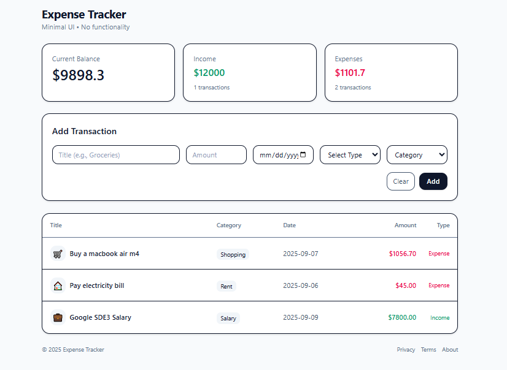

# 💰 Expense Tracker (React)

A comprehensive **Personal Expense Tracker** built with **React** for managing income and expenses with categories, filtering, and persistent data storage.

---

## Preview



---
## 🚀 Features

- 💰 Add income and expense transactions
- 🏷️ Categorize transactions
- 📊 Balance calculation
- 🔍 Filter and search transactions
- 💾 Local storage persistence
- 📱 Responsive design
- 🎨 Clean and intuitive UI

---

## 🛠️ Tech Stack

- **React 18+**
- **Custom Hooks**
- **Local Storage**
- **CSS3**
- **Vite**
- **JavaScript (ES6+)**

---

## 📂 Project Structure

expense-tracker/
├── src/
│   ├── hooks/
│   │   └── LocalStorage.jsx # Local storage hook
│   ├── App.jsx # Main component
│   └── main.jsx # Entry point

---

## ⚡ Setup Instructions

1. **Install Dependencies**:
```bash
npm install
```

2. **Start Development Server**:
```bash
npm run dev
```

3. **Open in Browser**:
   - Navigate to `http://localhost:5173`

---

## 🔧 Key React Concepts Used

- **Custom Hooks** - Local storage management
- **useState Hook** - Transaction state
- **useEffect Hook** - Data persistence
- **Component Composition** - Modular architecture

---

## 🙌 Author

**Zakryia Bukhari**

---