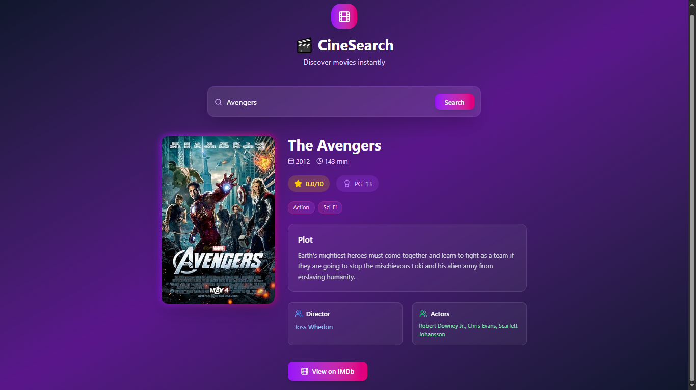

# 🎬 Movie Search App (React)

A modern **Movie Search Application** built with **React** that allows users to search for movies, view detailed information, and explore movie databases with a beautiful, responsive interface.

---

## Preview

---
## 🚀 Features

- 🔍 Search movies by title
- 🎭 Detailed movie information display
- 🖼️ Movie posters and images
- ⭐ Movie ratings and reviews
- 📅 Release dates and runtime
- 🎨 Responsive card-based layout
- ⏳ Loading states with custom loader
- 📱 Mobile-friendly design

---

## 🛠️ Tech Stack

- **React 18+**
- **Movie Database API**
- **Custom Components**
- **CSS3**
- **Vite**
- **JavaScript (ES6+)**

---

## 📂 Project Structure

movie-search/
├── src/
│   ├── component/
│   │   └── DotLoader.jsx # Custom loading component
│   ├── App.jsx # Main application
│   ├── main.jsx # Entry point
│   └── index.css # Global styles
├── package.json
└── README.md

---

## ⚡ Setup Instructions

1. **Install Dependencies**:
```bash
npm install
```

2. **Start Development Server**:
```bash
npm run dev
```

3. **Open in Browser**:
   - Navigate to `http://localhost:5173`

---

## 🌐 How It Works

1. **Movie Search**:
   - Enter movie title in search input
   - Real-time search as you type
   - Displays search results in card format

2. **Movie Details**:
   - Click on movie cards for detailed view
   - Shows poster, title, rating, and description
   - Includes release date and runtime information

3. **Loading States**:
   - Custom DotLoader component for better UX
   - Loading indicators during API calls
   - Smooth transitions between states

4. **Error Handling**:
   - Handles API errors gracefully
   - Shows appropriate messages for no results
   - Network error management

---

## 🔧 Key React Concepts Used

- **useState Hook** - Search state and movie data
- **useEffect Hook** - API calls and side effects
- **Component Composition** - Modular movie cards
- **Conditional Rendering** - Loading and error states
- **Event Handling** - Search functionality
- **API Integration** - External movie database

---

## 🎨 Custom Components

### DotLoader Component
```jsx
// Custom loading animation
const DotLoader = () => {
  return (
    <div className="dot-loader">
      <div className="dot"></div>
      <div className="dot"></div>
      <div className="dot"></div>
    </div>
  )
}
```

---

## 📌 Features Breakdown

- **Search Functionality**: Real-time movie search
- **Movie Cards**: Beautiful card-based layout
- **Responsive Design**: Works on all screen sizes
- **Loading Animation**: Custom dot loader component
- **Error Handling**: Graceful error management
- **Movie Details**: Comprehensive movie information

---

## 🎯 API Integration

- Fetches data from movie database API
- Handles API rate limiting
- Caches search results for better performance
- Manages API errors and network issues

---

## 🙌 Author

**Zakryia Bukhari**  
GitHub: https://github.com/Zakariya-Zahid

---

## 📄 License

This project is open source and available under the MIT License.