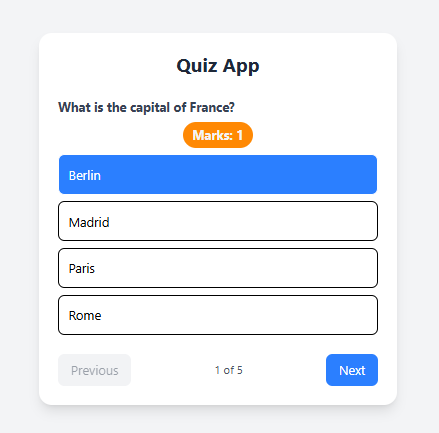

# 🧠 Quiz App (React)

An interactive **Quiz Application** built with **React** featuring multiple-choice questions, scoring system, timer functionality, and result tracking.

---

## Preview

---

## 🚀 Features

- 🧠 Multiple-choice questions
- ⏰ Timer functionality
- 📊 Score tracking
- 🎯 Result display
- 🔄 Quiz restart option
- 📱 Responsive design
- 🎨 Interactive UI

---

## 🛠️ Tech Stack

- **React 18+**
- **useState Hook**
- **useEffect Hook**
- **JavaScript Timers**
- **CSS3**
- **Vite**

---

## ⚡ Setup Instructions

1. **Install Dependencies**:
```bash
npm install
```

2. **Start Development Server**:
```bash
npm run dev
```

3. **Open in Browser**:
   - Navigate to `http://localhost:5173`

---

## 🔧 Key React Concepts Used

- **useState Hook** - Quiz state management
- **useEffect Hook** - Timer management
- **Event Handling** - Answer selection
- **Conditional Rendering** - Quiz flow

---

## 🙌 Author

**Zakryia Bukhari**