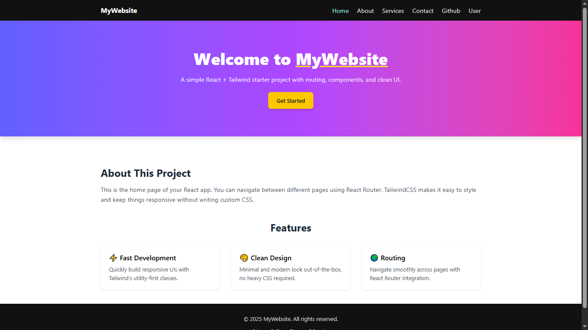

# 🛣️ React Router Demo

A comprehensive **React Router** demonstration showcasing navigation, routing, nested routes, dynamic parameters, and modern routing patterns in a multi-page React application.

---
## Preview


---
## 🚀 Features

- 🧭 Multi-page navigation with React Router
- 🔗 Nested routing structure
- 📄 Dynamic route parameters
- 🎯 Active link highlighting
- 📱 Responsive navigation design
- 🏠 Home, About, Services, Contact pages
- 👤 Dynamic user profiles
- 🐙 GitHub API integration
- 🎨 Clean and modern UI

---

## 🛠️ Tech Stack

- **React 18+**
- **React Router DOM**
- **TailwindCSS**
- **GitHub API**
- **Vite**
- **JavaScript (ES6+)**

---

## 📂 Project Structure

react-router-demo/
├── src/
│   ├── components/
│   │   ├── Header.jsx # Navigation header
│   │   ├── Footer.jsx # Page footer
│   │   ├── Github.jsx # GitHub profile component
│   │   └── User.jsx # User profile component
│   ├── pages/
│   │   ├── Home.jsx # Home page
│   │   ├── About.jsx # About page
│   │   ├── Services.jsx # Services page
│   │   └── Contact.jsx # Contact page
│   ├── Layout.jsx # Main layout wrapper
│   ├── App.jsx # Router configuration
│   ├── main.jsx # Entry point
│   └── index.css # Global styles
├── package.json
└── README.md

---

## ⚡ Setup Instructions

1. **Install Dependencies**:
```bash
npm install
```

2. **Start Development Server**:
```bash
npm run dev
```

3. **Open in Browser**:
   - Navigate to `http://localhost:5173`

---

## 🌐 How It Works

1. **Basic Routing**:
   - Navigate between Home, About, Services, and Contact pages
   - Clean URLs for each page
   - Browser back/forward button support

2. **Dynamic Routes**:
   - User profile pages with dynamic parameters
   - GitHub profile integration with API calls
   - URL parameters for data fetching

3. **Nested Routing**:
   - Layout component wraps all pages
   - Consistent header and footer across routes
   - Outlet component for page content

4. **Navigation**:
   - Active link highlighting
   - Responsive navigation menu
   - Smooth transitions between pages

---

## 🔧 Key React Router Concepts

- **BrowserRouter** - Main router wrapper
- **Routes & Route** - Route configuration
- **NavLink** - Navigation with active states
- **useParams** - Accessing URL parameters
- **Outlet** - Nested route rendering
- **Layout Routes** - Shared layout components

---

## 📱 Pages Overview

- **Home** - Landing page with welcome content
- **About** - Information about the project
- **Services** - List of available services
- **Contact** - Contact form and information
- **User/:id** - Dynamic user profile pages
- **GitHub** - GitHub profile integration

---

## 🎯 Routing Configuration

```jsx
// Example routing setup
<Routes>
  <Route path="/" element={<Layout />}>
    <Route index element={<Home />} />
    <Route path="about" element={<About />} />
    <Route path="services" element={<Services />} />
    <Route path="contact" element={<Contact />} />
    <Route path="user/:id" element={<User />} />
    <Route path="github" element={<Github />} />
  </Route>
</Routes>
```

---

## 📌 Notes

- Demonstrates modern React Router v6 patterns
- Includes error handling for invalid routes
- GitHub API integration for dynamic content
- Responsive design for all screen sizes
- Clean and semantic URL structure

---

## 🙌 Author

**Zakryia Bukhari**  
GitHub: https://github.com/Zakariya-Zahid

---

## 📄 License

This project is open source and available under the MIT License.