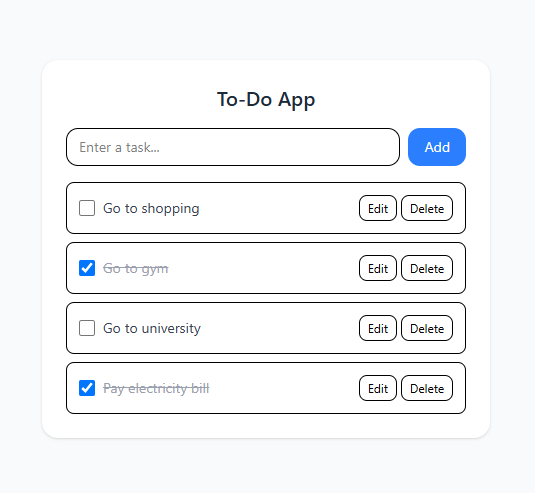

# ✅ Todo List Advanced (React)

A feature-rich **Advanced Todo Application** built with **React** including categories, priorities, due dates, filtering, and comprehensive task management capabilities.

---

## Preview


---
## 🚀 Features

- ✅ Add, edit, delete todos
- 🏷️ Todo categories
- ⭐ Priority levels
- 📅 Due dates
- 🔍 Advanced filtering
- 📊 Task statistics
- 💾 Local storage persistence
- 📱 Responsive design

---

## 🛠️ Tech Stack

- **React 18+**
- **useState Hook**
- **useEffect Hook**
- **Local Storage**
- **CSS3**
- **Vite**

---

## ⚡ Setup Instructions

1. **Install Dependencies**:
```bash
npm install
```

2. **Start Development Server**:
```bash
npm run dev
```

3. **Open in Browser**:
   - Navigate to `http://localhost:5173`

---

## 🔧 Key React Concepts Used

- **useState Hook** - Complex state management
- **useEffect Hook** - Data persistence
- **Component Composition** - Modular architecture
- **Event Handling** - User interactions

---

## 🙌 Author

**Zakryia Bukhari**