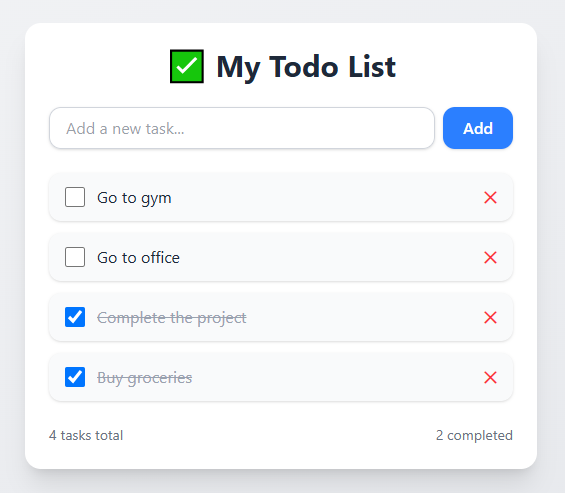

# ✅ Todo List Basic (React)

A simple **Todo List Application** built with **React** focusing on core CRUD operations and fundamental React concepts for task management.

---

## Preview

---
## 🚀 Features

- ✅ Add new todos
- ✏️ Edit existing todos
- 🗑️ Delete todos
- ☑️ Mark as complete/incomplete
- 💾 Local storage persistence
- 📱 Responsive design
- 🎨 Clean and simple UI

---

## 🛠️ Tech Stack

- **React 18+**
- **useState Hook**
- **useEffect Hook**
- **Local Storage**
- **CSS3**
- **Vite**

---

## ⚡ Setup Instructions

1. **Install Dependencies**:
```bash
npm install
```

2. **Start Development Server**:
```bash
npm run dev
```

3. **Open in Browser**:
   - Navigate to `http://localhost:5173`

---

## 🔧 Key React Concepts Used

- **useState Hook** - Todo state management
- **useEffect Hook** - Data persistence
- **Event Handling** - User interactions
- **Conditional Rendering** - Todo status display

---

## 🙌 Author

**Zakryia Bukhari**